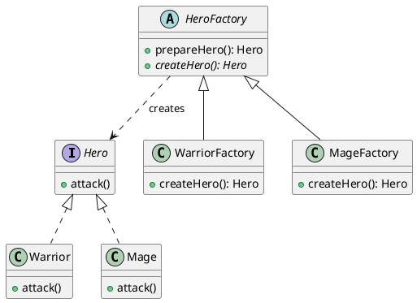
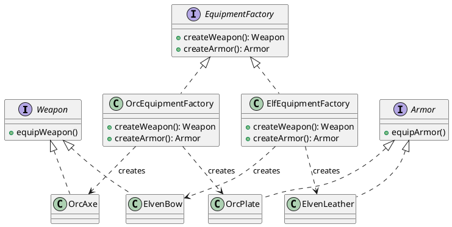

# Report: Software Design Patterns Assignment #2

## 1. Introduction
В данном проекте рассматривается применение двух порождающих паттернов проектирования: **Factory Method** и **Abstract Factory** на примере игрового сеттинга (RPG).

*   **Part A (Factory Method)** был выбран для создания героев. Этот паттерн идеально подходит, когда нам нужно делегировать создание конкретного типа объекта (Warrior или Mage) подклассам фабрики, при этом работая с объектами через общий интерфейс `Hero`.
*   **Part B (Abstract Factory)** используется для создания систем снаряжения (оружие и броня), разделенных по фракциям (Орки и Эльфы). Этот паттерн позволяет создавать семейства связанных объектов, гарантируя, что орочий топор будет использоваться вместе с орочьей броней, а не эльфийской.

## 2. UML Diagrams

### Part A: Factory Method


### Part B: Abstract Factory


## 3. Clean Code Section

В проекте применены следующие принципы чистого кода:

1.  **Meaningful Names (Осмысленные имена):**
    Все классы и методы имеют говорящие названия. Вместо `H1` или `f1()` используются `Hero`, `Warrior`, `createHero()`.
    *Example:* `Hero warrior = warriorFactory.createHero();` — сразу понятно, что происходит.

2.  **Elimination of if/else via polymorphism (Исключение if/else через полиморфизм):**
    В клиентском коде (`Main.java`) нет ни одного оператора `if` или `switch` для выбора типа героя или снаряжения. Логика выбора вынесена в создание конкретной фабрики.
    *Before:* `if (type == "Orc") return new OrcAxe();`
    *After:* `Weapon weapon = factory.createWeapon();`

3.  **Single Responsibility Principle (Принцип единой ответственности):**
    Каждый класс отвечает за свою задачу. `Warrior` отвечает за атаку воина, `WarriorFactory` — только за создание воина.

4.  **Open/Closed Principle (Принцип открытости/закрытости):**
    Система легко расширяется. Чтобы добавить новый класс героя (например, `Archer`), достаточно создать `Archer` и `ArcherFactory`, не изменяя существующий код `HeroFactory` или `Main`.

5.  **Small Methods (Маленькие методы):**
    Методы выполняют одну простую операцию и занимают всего несколько строк кода, что делает их легко читаемыми.
    *Example:* Метод `createHero()` в конкретных фабриках содержит всего одну строку: `return new Mage();`.

## 4. Conclusion
Разница между Factory Method и Abstract Factory заключается в уровне абстракции и масштабе:
*   **Factory Method** сфокусирован на создании одного продукта (один метод для одного интерфейса). Мы используем его, когда нам нужно просто создать объект, не привязываясь к его конкретной реализации.
*   **Abstract Factory** предназначен для создания целых семейств связанных продуктов. Мы выбираем его, когда объекты должны использоваться вместе (как комплект снаряжения одной фракции).

В работе я бы выбрал Factory Method для простых задач создания одиночных объектов, а Abstract Factory — для сложных систем, где важна согласованность группы объектов.

## 5. README.md
Заготовка для репозитория:

### RPG Game Factory Project

Проект демонстрирует реализацию паттернов проектирования Factory Method и Abstract Factory на языке Java 17.

#### Структура проекта:
*   `com.game.factorymethod` — Реализация паттерна "Фабричный метод" для создания героев.
*   `com.game.abstractfactory` — Реализация паттерна "Абстрактная фабрика" для создания комплектов снаряжения.
*   `com.game.main` — Точка входа в приложение (Client).

#### Инструкция по запуску:
1.  Скомпилируйте проект:
    ```bash
    javac -d bin src/com/game/factorymethod/*.java src/com/game/abstractfactory/*.java src/com/game/main/*.java
    ```
2.  Запустите приложение:
    ```bash
    java -cp bin com.game.main.Main
    ```
